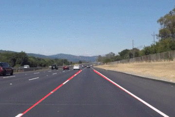

# 无人驾驶纳米学位-第一学期-项目1-车道线检测
# CarND-Term1-Project1-Lane_Line_Finding

[//]: # (Image References)
[image1]: ./examples/example.gif
[image2]: ./Pass-certificate.png

This is the 1st project in Term1 for the **Self-Driving Car Engineer** Nanodegree program at [Udacity](https://cn.udacity.com/course/self-driving-car-engineer--nd013)

The project used **Python** and **OpenCV** (Open-Source Computer Vision) to detect lane lines in images and videos. 

The useful tools used in the project including:
 - Color selection 
 - Region of interest selection
 - Grayscaling
 - Gaussian smoothing, 
 - Canny Edge Detection 
 - Hough Tranform line detection
 
 Here is the Project file [Proj1.ipynb](./Proj1.ipynb)  
 Note:  you may use https://nbviewer.jupyter.org/ to quickly load .ipynb file
 
 Here is my [Project Report/Writeup](./Project_Writeup.md)  
 Check out  [Project Requirements](./Project_README.md)
 
---
#### Example output 

[output video1 - solidWhiteRight.mp4](./solidWhiteRight.mp4)  
[output video2 - solidYellowLeft.mp4](./solidYellowLeft.mp4)

---
#### Certificate for the Project Completion

